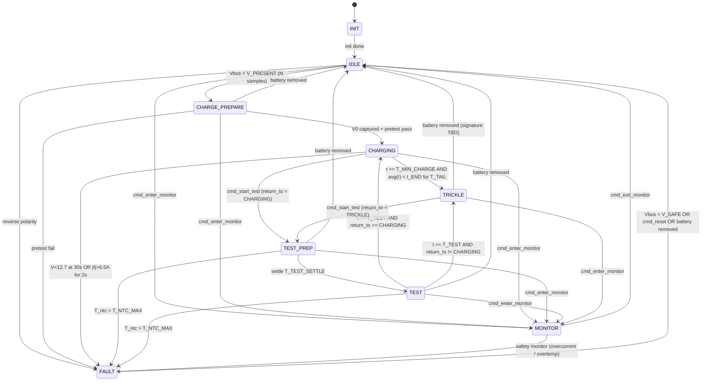

# Charge State Machine — BatteryMonitorV2

Design reference for the battery-charge controller in
[`Core/Src/charge_state.c`](../Core/Src/charge_state.c).

The authoritative copy of the diagram + tables lives in the header
comment of [`Core/Inc/charge_state.h`](../Core/Inc/charge_state.h) so
the project's `state-machine-reviewer` agent can diff it directly
against the enum and switch cases. This file is the human-facing
rendering — keep it in lockstep with the header when transitions or
outputs change.

---

## Hardware topology

Single SPDT relay (K1) plus a bleed FET. K1 selects which side of
the SPDT the battery is connected to; the bleed FET is only
electrically meaningful while K1 is on.

```
              K1 enabled                    K1 disabled
              ----------                    -----------
   Charger ── X (open)                    Charger ───┐
                                                     │
   + Battery ──[INA]── Vbus               + Battery ─┴── Vbus
                        │
                     [Bleed FET]
                        │
                       GND
```

| K1 | Bleed | Effect |
|---|---|---|
| on  | off | charger isolated, battery sits on bleed leg with no load |
| on  | on  | charger isolated, ~800 mA / ~10 W drained through bleed |
| off | off | charger connected to battery (charge / float / observe) |
| off | on  | **illegal** — bleed leg is physically disconnected, but the FET command across the open contact still matters at the K1 transition (see sequencing invariant below) |

### Hardware quirk — K1 coil is battery-powered

With no battery present, the K1 coil has no power. The relay is
forced off regardless of GPIO command — charger sits across the
empty battery position, bleed leg isolated.

Consequences:

- IDLE detects battery insertion as Vbus shifting from the
  charger's no-load signature to a true battery voltage.
- States that request K1=on (CHARGE_PREPARE, TEST_PREP, TEST,
  FAULT) lose isolation if the pack is yanked mid-state. Each
  accepts "battery removed" as an exit to IDLE.
- Cold boot: K1 is de-energized until the MCU asserts it. A
  battery already present at reset sees the charger for the ~ms
  until `apply_outputs()` runs.
- FAULT drain (Vbus < V_SAFE) assumes the battery is still
  present. A yanked pack exits via the battery-removed path
  instead — otherwise FAULT would latch on the charger's no-load
  voltage.

### Sequencing invariant

`apply_outputs()` always drops the bleed FET **before** moving K1.
The SPDT is break-before-make; without bleed-off first, the
~800 mA load would hot-switch the contact at every K1 transition.
A 20 ms relay-settle delay sits between the K1 write and the bleed
re-assert.

---

## State diagram



---

## Per-state outputs

| State          | K1   | Bleed         | Fan  | In-state work |
|---|---|---|---|---|
| INIT           | on   | off           | 0%   | mutex / queue creation, snapshot zero |
| IDLE           | on   | off           | low  | sample Vbus, watch for battery insertion |
| CHARGE_PREPARE | on   | off→pulse→off | low  | capture V0; bleed-pulse pretest (ΔV sag check) |
| CHARGING       | off  | off           | med  | timers: 30 s rise, 2 s OC, T_MIN_CHARGE, T_TAIL avg-I |
| TEST_PREP      | on   | off           | low  | 5–10 s settle, capture V_pre_test |
| TEST           | on   | on            | 100% | T_TEST timer, ΔV sag, NTC watch |
| TRICKLE        | off  | off           | low  | observe charger float; watch for battery removal |
| MONITOR        | off  | off           | low  | diagnostic; no MCU control logic |
| FAULT          | per reason          | per  | wait for Vbus<V_SAFE / cmd_reset / battery removed |

### FAULT outputs by reason

| Reason          | K1  | Bleed | Rationale |
|---|---|---|---|
| CHRG_TIMEOUT    | on  | on    | charger suspect; drain via bleed |
| OVERCURRENT     | on  | off   | don't add more load until reviewed |
| OVERTEMP        | on  | off   | pack already hot; don't load it further |
| BATT_REJECTED   | on  | on    | drain to safe V |
| SAFETY_OTHER    | on  | off   | conservative default |

---

## Safety monitor contract

A separate, higher-priority task observes telemetry (and the
forthcoming NTC) for hardware-safety conditions. On detection it
calls `charge_state_safety_fault(reason)` which:

1. Immediately drops the outputs to a conservative safe state
   (K1 on isolating the charger, bleed off, fan low).
2. Posts `EVT_SAFETY_FAULT` to the charge-state event queue.

The state machine picks up the event on its next tick, transitions
into FAULT, and re-asserts the per-reason outputs from the FAULT
table above. The "immediate hardware safe-state + deferred policy"
split keeps a single owner of K1/bleed/fan while still giving the
monitor a sub-tick reaction path.

Safety **stays active in MONITOR** — "no control logic" means no
charge policy, not no hardware safety.

---

## Tunables

See `Core/Inc/charge_state.h` for the canonical `#define`s.
Bench-data review pending for several:

| Constant | Value | Notes |
|---|---|---|
| `V_PRESENT_MV` | 10500 | IDLE → CHARGE_PREPARE threshold |
| `V_REVERSE_MV` | −500 | reverse-polarity guard |
| `V_SAFE_MV` | 10000 | FAULT → IDLE drain target |
| `V_CHARGE_RISE_MV` | 12700 | CHARGING 30 s sanity threshold |
| `T_PRESENT_SAMPLES` | 5 | battery-detect debounce (ticks @ 100 ms) |
| `T_MIN_CHARGE_S` | 180 | minimum charging time before tail check |
| `T_TAIL_S` | 180 | avg-current window for tail termination |
| `I_END_MA` | 100 | tail-current threshold (~C/50 for a 5 Ah pack) |
| `T_CHARGE_TIMEOUT_S` | 30 | Vbus must rise above V_CHARGE_RISE_MV |
| `I_OC_MA` | 6500 | overcurrent threshold |
| `T_OC_MS` | 2000 | overcurrent dwell |
| `T_TEST_SETTLE_S` | 7 | TEST_PREP settle (5–10 s acceptable) |
| `T_TEST_S` | 60 | TEST load-test duration |
| `T_NTC_MAX_C` | 60 | **TBR** — depends on bleed-resistor thermal |
| `T_BATT_GONE_S` | 3 | derived-signal debounce for battery-removed |

---

## Status — what's wired today

The header + .c skeleton lands the framework: lifecycle, snapshot
publish, event queue, safety-monitor entry, `apply_outputs()`
sequencing, and the transitions that can be exercised without real
telemetry (INIT→IDLE, IDLE↔MONITOR, IDLE→PREPARE on debounced Vbus,
PREPARE→CHARGING, TEST_PREP→TEST round-trip, TRICKLE→IDLE on
removal, FAULT entry/exit).

Each of these lands in a focused follow-up commit:

- CHARGING termination (30 s timeout, 6.5 A / 2 s OC, tail-current).
- CHARGE_PREPARE pretest pulse + ΔV sag check.
- TEST / TEST_PREP NTC overtemp detection.
- TRICKLE battery-removal signature (bench-characterized).
- Controller-owned INA238 read pump (replacing the current
  `monitor_state` placeholder consumption).
- Per-state telemetry-driven test coverage to match.
